# Tech Challenge - Fase 1 - Machine Learning Engineering

Este repositório contém o projeto do Tech Challenge da Fase 1 da Pós-Tech FIAP (Machine Learning Engineering). O objetivo é desenvolver uma API pública para consulta de livros, incluindo um pipeline de ingestão de dados (web scraping) e preparação para modelos de Machine Learning.

## Link do Video da apresentação

Apresentação **: [http://www.youtube.com/(http://www.youtube.com)

## Descrição do Projeto

O projeto consiste em uma aplicação completa que realiza:
1.  **Web Scraping**: Extração automática de dados de livros do site [Books to Scrape](https://books.toscrape.com/).
2.  **Armazenamento**: Os dados extraídos são salvos localmente em formato CSV.
3.  **API RESTful**: Uma API construída com **FastAPI** que expõe os dados para consulta, gerenciamento e consumo por modelos de ML.
4.  **Autenticação**: Sistema de login e proteção de rotas via JWT.

### Arquitetura

O fluxo de dados segue a arquitetura:
**Ingestão/Scraping** → **Processamento/Armazenamento (CSV)** → **API (FastAPI)** → **Consumo (Cliente/ML)**

**Diagrama Macro**


**Diagrama Arquitetura**



## Instalação e Configuração

### Pré-requisitos
- Python 3.11 ou superior
- PostgreSQL 16.11

### Passos para Instalação

1.  **Clone o repositório** e acesse a pasta do projeto.

2.  **Crie e ative um ambiente virtual** (opcional, mas recomendado).

3.  **Instale as dependências**:
    ```bash
    pip install -r requirements.txt
    ```

4.  **Configure as variáveis de ambiente**:
    Copie o arquivo de exemplo `.env.example` para `.env`:
    - Windows (PowerShell):
      ```powershell
      Copy-Item .env.example .env
      ```
    - Linux/Mac:
      ```bash
      cp .env.example .env
      ```
    *Ajuste as chaves no arquivo `.env` se necessário, mas os valores padrão funcionam para desenvolvimento.*

## Como Executar

Para iniciar o servidor da API, execute o comando:

```bash
uvicorn app.main:app --reload
```

A API estará acessível em: `http://projeto1.cec.dev.br:8000`

## Documentação da API

A documentação interativa (Swagger UI) pode ser acessada em:
- **Swagger UI**: [http://projeto1.cec.dev.br:8000/docs](http://projeto1.cec.dev.br:8000/docs)
- **ReDoc**: [http://projeto1.cec.dev.br:8000/redoc](http://projeto1.cec.dev.br:8000/redoc)

### Principais Endpoints

#### Livros (Core)
- `GET /api/v1/books`: Lista todos os livros.
- `GET /api/v1/books/{id}`: Detalhes de um livro específico.
- `GET /api/v1/books/search`: Busca por título e/ou categoria.
- `GET /api/v1/categories`: Lista categorias disponíveis.
- `GET /api/v1/books/top-rated/{amount}`: Lista os melhores avaliados.
- `GET /api/v1/books/price-range`: Filtra por faixa de preço.

#### Web Scraping
- `GET /api/v1/scraping/trigger`: Inicia o processo de extração de dados (Requer Autenticação).

#### Autenticação (JWT)
- `POST /api/v1/auth/login`: Realiza login e retorna o Token de Acesso.
- `POST /api/v1/auth/refresh`: Renova o token.
- `GET /api/v1/auth/user-info`: Informações do usuário atual.

#### Machine Learning
- `GET /api/v1/ml/features`: Dados formatados para features de modelos.
- `GET /api/v1/ml/training-data`: Download do dataset (CSV) para treinamento.
- `POST /api/v1/ml/predictions`: Endpoint placeholder para recebimento de predições.

#### Estatísticas (Insights)
- `GET /api/v1/stats/overview`: Visão geral (total de livros, preço médio).
- `GET /api/v1/stats/categories`: Estatísticas por categoria.

## Diagrama e Coerência

O diagrama `diagrama.svg` presente no repositório representa fielmente a arquitetura implementada:
1.  O serviço de scraping coleta os dados.
2.  Os dados persistidos serão carregados pelo Data Service e armazenados no Banco de dados Postgree SQL.
3.  A API FastAPI expõe esses dados.
4.  Existem saídas claras para Consumo Geral e Treinamento de ML.

---
**Tech Challenge - Módulo 1**
